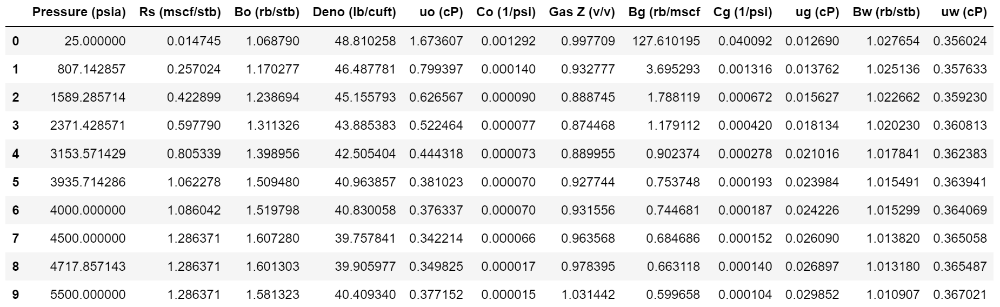

===================================
Oil PVT & Flow Rates
===================================

Oil property calculations including bubble point pressure, solution GOR, formation volume factor, density, viscosity, compressibility, and flow rates (radial and linear with Vogel correction). Provides correlation harmonization for consistent Pb/Rsb/viscosity matching and black oil table generation for reservoir simulation.

Calculation Methods and Class Objects
=====================================
pyResToolBox uses class objects to track calculation options through the functions. Class objects can be set via strings or explicitly via object options

.. list-table:: Method Variables & Class Objects
   :widths: 10 15 40
   :header-rows: 1

   * - Class Variable
     - Class Object 
     - Class Description & Options
   * - zmethod
     - z_method
     - Method for calculating gas Z-Factor. Defaults to 'DAK'. 
       Options are:
        + 'DAK': Dranchuk & Abou-Kassem (1975) using from Equations 2.7-2.8 from 'Petroleum Reservoir Fluid Property Correlations' by W. McCain et al. - Slowest, Most Accurate
        + 'HY': Hall & Yarborough (1973) - Second Fastest
        + 'WYW': Wang, Ye & Wu (2021) - Fastest, Least Accurate
        + 'BUR'/'BNS': Fast, can handle 100% inerts and Hydrogen. Tuned 5 component Peng Robinson EOS model, Burgoyne, Nielsen & Stanko (2025), `SPE-229932-MS <https://doi.org/10.2118/229932-MS>`_
   * - cmethod
     - c_method
     - Method for calculating gas critical properties. Defaults to 'PMC' 
       Options are:
        + 'SUT': Sutton with Wichert & Aziz non-hydrocarbon corrections
        + 'PMC': Piper, McCain & Corredor (1999) correlation, using equations 2.4 - 2.6 from 'Petroleum Reservoir Fluid Property Correlations' by W. McCain et al.
        + 'BUR': Burgoyne method (2024). If h2 > 0, or the 'BUR' method is used for Z-Factor then 'BUR' will automatically be used
   * - pbmethod
     - pb_method
     - Method for calculating bubble point pressure of oil. Defaults to 'VELAR'. 
       Choices are:
        + 'STAN': Standing Correlation (1947)
        + 'VALMC': Valko-McCain Correlation (2003)
        + 'VELAR': Velarde, Blasingame 
   * - rsmethod
     - rs_method
     - Method for calculating solution gas-oil ratio. Defaults to 'VELAR'
       Options are:
        + 'VELAR': Velarde, Blasingame & McCain (1999)
        + 'STAN': Standing Correlation (1947)
        + 'VALMC': Valko-McCain Correlation (2003) - Only for oil_rs_bub (Rs at Pb)
   * - comethod
     - co_method
     - Method for calculating undersaturated oil compressibility. Defaults to 'EXPLT'.
       Options are:
        + 'EXPLT': Explicit calculation with numerical derivatives via co = -1/bo*dBo/dp at constant Rs.
   * - denomethod
     - deno_method
     - Method for calculating oil density. Defaults to 'SWMH'
       Options are:
        + 'SWMH': Standing, White, McCain-Hill (1995)
   * - bomethod
     - bo_method
     - Method for calculating oil formation volume factor. Defaults to 'MCAIN'
       Options are:
        + 'STAN': Standing Correlation
        + 'MCAIN': McCain approach, calculating from densities -- Default

Users can specify which calculation method to use either by passing an option string, or a class object to any given function. The implementation of class objects should make it easier to program in an IDE that supports type hinting

Examples:

Calculating bubble point pressure with Standing correlation via option string, and then via class object

.. code-block:: python

    >>> from pyrestoolbox import oil
    >>> oil.oil_pbub(api=43, degf=185, rsb=2350, sg_g = 0.72, pbmethod ='STAN')
    6406.067846808766
    
    >>> oil.oil_pbub(api=43, degf=185, rsb=2350, sg_g = 0.72, pbmethod = oil.pb_method.STAN)
    6406.063846808766

Unit System Support
===================
All PVT and flow functions accept an optional ``metric=False`` parameter. When ``metric=True``, inputs and outputs use Eclipse METRIC units:

.. list-table:: Unit Conventions
   :widths: 25 25 25
   :header-rows: 1

   * - Quantity
     - Oilfield (default)
     - Metric (metric=True)
   * - Pressure
     - psia
     - barsa
   * - Temperature
     - deg F
     - deg C
   * - Solution GOR
     - scf/stb
     - sm3/sm3
   * - FVF
     - rb/stb
     - rm3/sm3
   * - Density
     - lb/cuft
     - kg/m3
   * - Compressibility
     - 1/psi
     - 1/barsa
   * - Oil rate
     - stb/d
     - sm3/d
   * - Length / Radius
     - ft
     - m
   * - Area
     - ft2
     - m2
   * - Tc / Tb (Twu)
     - deg R
     - K
   * - Pc (Twu)
     - psia
     - barsa
   * - Vc (Twu)
     - cuft/lbmol
     - m3/kmol

.. note::

   Dimensionless functions (``oil_ja_sg``, ``oil_api``, ``oil_sg``, ``sg_evolved_gas``, ``sg_st_gas``, ``sgg_wt_avg``) do not have a ``metric`` parameter.

Function List
=============

.. list-table:: Oil Functions
   :widths: 15 40
   :header-rows: 1

   * - Task
     - Function
   * - Oil Density from MW 
     - `pyrestoolbox.oil.oil_ja_sg`_  
   * - Oil Critical Properties with Twu
     - `pyrestoolbox.oil.oil_twu_props`_
   * - Incrememtal GOR post Separation
     - `pyrestoolbox.oil.oil_rs_st`_
   * - Oil Bubble Point Pressure
     - `pyrestoolbox.oil.oil_pbub`_
   * - Oil GOR at Pb
     - `pyrestoolbox.oil.oil_rs_bub`_
   * - Oil GOR at P
     - `pyrestoolbox.oil.oil_rs`_  
   * - Oil Compressibility
     - `pyrestoolbox.oil.oil_co`_
   * - Total Two-Phase Oil FVF
     - `pyrestoolbox.oil.oil_bt`_
   * - Oil Density
     - `pyrestoolbox.oil.oil_deno`_
   * - Oil Formation Volume Factor
     - `pyrestoolbox.oil.oil_bo`_
   * - Oil Viscosity
     - `pyrestoolbox.oil.oil_viso`_
   * - Harmonize Pb, Rsb, and viscosity (find consistent values and scaling factors)
     - `pyrestoolbox.oil.oil_harmonize`_
   * - Generate Black Oil Table data (v3.0: see also simtools.make_bot_og)
     - `pyrestoolbox.oil.make_bot_og`_
   * - Estimate soln gas SG from oil
     - `pyrestoolbox.oil.sg_evolved_gas`_
   * - Estimate SG of gas post separator
     - `pyrestoolbox.oil.sg_st_gas`_
   * - Weighted average surface gas SG
     - `pyrestoolbox.oil.sgg_wt_avg`_  
   * - Oil API from SG
     - `pyrestoolbox.oil.oil_api`_  
   * - Oil SG from API
     - `pyrestoolbox.oil.oil_sg`_  
   * - Oil Flow Rate Radial
     - `pyrestoolbox.oil.oil_rate_radial`_
   * - Oil Flow Rate Linear
     - `pyrestoolbox.oil.oil_rate_linear`_
   * - Oil PVT Wrapper
     - `pyrestoolbox.oil.OilPVT`_

pyrestoolbox.oil.oil_ja_sg
======================

.. code-block:: python

    oil_ja_sg(mw, ja) -> float

Returns liquid hydrocarbon specific gravity (SG relative to water) at stock tank conditions using Jacoby Aromaticity Factor relationship 

.. list-table:: Inputs
   :widths: 10 15 40
   :header-rows: 1

   * - Parameter
     - Type
     - Description
   * - mw
     - float
     - Molecular weight of the liquid (g/gmole or lb/lb.mol)   
   * - ja
     - float
     - Jacoby aromaticity factor, vary between 0 (Paraffins) - 1 (Aromatic).

.. list-table:: Returns
   :widths: 10 15 40
   :header-rows: 1

   * - Name
     - Type
     - Description
   * -
     - float
     - Oil specific gravity (relative to water)

Examples:

.. code-block:: python

    >>> oil.oil_ja_sg(mw=150, ja=0.5)
    0.8583666666666667

pyrestoolbox.oil.oil_twu_props
==================

.. code-block:: python

    oil_twu_props(mw, ja = 0, sg = 0, damp = 1, metric = False) -> tuple

Returns tuple of liquid critical parameters - sg, tb (deg R, or K if metric=True), tc (deg R, or K if metric=True), pc (psia, or barsa if metric=True), vc (cuft/lbmol, or m3/kmol if metric=True) - using correlation method from Twu (1984). Modified with damping factor proposed by A. Zick between 0 (paraffin) and 1 (original Twu).
If sg is left as default, the Jacoby relationship shall be used to estimate specific gravity

.. list-table:: Inputs
   :widths: 10 15 40
   :header-rows: 1

   * - Parameter
     - Type
     - Description
   * - mw
     - float
     - Molecular weight of the liquid (g/gmole or lb/lb.mol)   
   * - ja
     - float
     - Jacoby aromaticity factor, vary between 0 (Paraffins) - 1 (Aromatic).
   * - sg
     - float
     - Specific gravity of the liquid (fraction relative to water density). Will use Jacoby method to estimate sg from mw if undefined
   * - damp
     - float
     - Damping factor proposed by A. Zick, modifying Eq 5.78 in the Whitson Monograph to permit some flexibility in the degree of parafinicity. Varies between 0 (paraffin) and 1 (original Twu). Defaults to 1
   * - metric
     - bool
     - Use Eclipse METRIC units for outputs (K, barsa, m3/kmol). Default False

.. list-table:: Returns (tuple)
   :widths: 10 15 40
   :header-rows: 1

   * - Index
     - Type
     - Description
   * - [0]
     - float
     - Specific gravity (relative to water)
   * - [1]
     - float
     - Normal boiling point (deg R, or K if metric=True)
   * - [2]
     - float
     - Critical temperature (deg R, or K if metric=True)
   * - [3]
     - float
     - Critical pressure (psia, or barsa if metric=True)
   * - [4]
     - float
     - Critical volume (cuft/lbmol, or m3/kmol if metric=True)

Examples:

.. code-block:: python

    >>> oil.oil_twu_props(mw=225, ja = 0.5)
    (0.8954444444444445,
    1068.3961103813851,
    1422.4620493584146,
    264.23402773211745,
    13.498328588856445)

    
pyrestoolbox.oil.oil_rs_st
===================

.. code-block:: python

    oil_rs_st(psp, degf_sp, api, metric = False) -> float

Estimates incremental gas evolved from separator liquid as it equilibrates to stock tank conditions (scf/stb, or sm3/sm3 if metric=True). Correlation reproduced from Valko McCain 2003 paper Eq 3-2. 

Rsb = Rsp + Rst (Solution GOR at bubble point = Separator GOR + Stock Tank GOR).
 
In absence of separator properties, a simple linear relationship with Rsp could be used instead.

rs_st = 0.1618 * Separator GOR (Adapted from Eq 3-4 in Valko McCain 2003 paper)

.. list-table:: Inputs
   :widths: 10 15 40
   :header-rows: 1

   * - Parameter
     - Type
     - Description
   * - psp
     - float
     - Separator pressure (psia, or barsa if metric=True).
   * - degf_sp
     - float
     - Separator temperature (deg F, or deg C if metric=True).
   * - api
     - float
     - Density of stock tank liquid (API)
   * - metric
     - bool
     - Use Eclipse METRIC units for inputs/outputs. Default False

.. list-table:: Returns
   :widths: 10 15 40
   :header-rows: 1

   * - Name
     - Type
     - Description
   * -
     - float
     - Incremental stock tank gas (scf/stb, or sm3/sm3 if metric=True)

Examples:

.. code-block:: python

    >>> oil.oil_rs_st(psp=114.7, degf_sp=80, api=38)
    4.176458005559282
    
pyrestoolbox.oil.oil_pbub
====================

.. code-block:: python

    oil_pbub(api, degf, rsb, sg_g =0, sg_sp =0, pbmethod ='VALMC', metric = False) -> float

Returns bubble point pressure (psia, or barsa if metric=True) calculated with different correlations.
At least one of sg_g and sg_sp must be supplied. This function will make simple assumption to estimate missing gas sg if only one is provided.

.. list-table:: Inputs
   :widths: 10 15 40
   :header-rows: 1

   * - Parameter
     - Type
     - Description
   * - api
     - float
     - Density of stock tank liquid (API)
   * - degf
     - float
     - Oil temperature (deg F, or deg C if metric=True).
   * - rsb
     - float
     - Solution GOR at bubble point (scf/stb, or sm3/sm3 if metric=True)
   * - sg_g
     - float
     - Weighted average specific gravity of surface gas, inclusive of gas evolved after separation (relative to air).
   * - sg_sp
     - float
     - Specific gravity of separator gas (relative to air)
   * - pbmethod
     - str or pb_method class object
     - The method of Pb calculation to be employed. See Class Objects section for details.
   * - metric
     - bool
     - Use Eclipse METRIC units for inputs/outputs. Default False

.. list-table:: Returns
   :widths: 10 15 40
   :header-rows: 1

   * - Name
     - Type
     - Description
   * -
     - float
     - Bubble point pressure (psia, or barsa if metric=True)

Examples:

.. code-block:: python

    >>> oil.oil_pbub(api=43, degf=185, rsb=2350, sg_g =0.72)
    5199.2406069808885

    >>> oil.oil_pbub(api=43, degf=185, rsb=2350, sg_sp = 0.72, pbmethod ='STAN')
    6390.281894698239

    >>> # Metric example: temperature in degC, rsb in sm3/sm3, returns Pb in barsa
    >>> oil.oil_pbub(api=43, degf=85, rsb=418.8, sg_g=0.72, metric=True)
    358.5685338835858

pyrestoolbox.oil.oil_rs_bub
===================

.. code-block:: python

    oil_rs_bub(api, degf, pb, sg_g =0, sg_sp =0, pbmethod ='VALMC', rsmethod='VELAR', metric = False) -> float

Returns solution GOR (scf/stb, or sm3/sm3 if metric=True) at bubble point pressure. Uses the inverse of the Bubble point pressure correlations, with the same method families. Note: At low pressures, the VALMC method will fail (generally when rsb < 10 scf/stb). The VALMC method will revert to the Standing method in these cases.
At least one of sg_g and sg_sp must be supplied. This function will make simple assumption to estimate missing gas sg if only one is provided.

.. list-table:: Inputs
   :widths: 10 15 40
   :header-rows: 1

   * - Parameter
     - Type
     - Description
   * - api
     - float
     - Density of stock tank liquid (API)
   * - degf
     - float
     - Oil Temperature (deg F, or deg C if metric=True)
   * - pb
     - float
     - Bubble point pressure (psia, or barsa if metric=True)
   * - sg_g
     - float
     - Weighted average specific gravity of surface gas, inclusive of gas evolved after separation (relative to air).
   * - sg_sp
     - float
     - Specific gravity of separator gas (relative to air).
   * - pbmethod
     - string or pb_method
     - The method of Pb calculation to be employed. `Calculation Methods and Class Objects`_.
   * - rsmethod
     - string or rs_method
     - The method of Rs calculation to be employed. `Calculation Methods and Class Objects`_.
   * - metric
     - bool
     - Use Eclipse METRIC units for inputs/outputs. Default False

.. list-table:: Returns
   :widths: 10 15 40
   :header-rows: 1

   * - Name
     - Type
     - Description
   * -
     - float
     - Solution GOR at bubble point (scf/stb, or sm3/sm3 if metric=True)

Examples:

.. code-block:: python

    >>> oil.oil_rs_bub(api=43, degf=185, pb=5179.5, sg_sp = 0.72)
    1872.666133282599
    

pyrestoolbox.oil.oil_rs
===================

.. code-block:: python

    oil_rs(api, degf, sg_sp, p, pb =0, rsb =0, rsmethod='VELAR', pbmethod='VALMC', metric = False) -> float

Returns solution gas oil ratio (scf/stb, or sm3/sm3 if metric=True) calculated with different correlations. Either pb, rsb or both need to be specified. If one is missing, the other will be calculated from correlation

.. list-table:: Inputs
   :widths: 10 15 40
   :header-rows: 1

   * - Parameter
     - Type
     - Description
   * - api
     - float
     - Density of stock tank liquid (API)
   * - degf
     - float
     - Oil Temperature (deg F, or deg C if metric=True)
   * - sg_sp
     - float
     - Separator gas gravity (relative to air).
   * - p
     - float
     - Pressure (psia, or barsa if metric=True).
   * - pb
     - float
     - Original bubble point pressure (psia, or barsa if metric=True)
   * - rsb
     - float
     - Original solution GOR at original bubble point pressure (scf/stb, or sm3/sm3 if metric=True)
   * - rsmethod
     - string or rs_method
     - The method of Rs calculation to be employed. `Calculation Methods and Class Objects`_.
   * - pbmethod
     - string or pb_method
     - The method of Pb calculation to be employed. `Calculation Methods and Class Objects`_.
   * - metric
     - bool
     - Use Eclipse METRIC units for inputs/outputs. Default False

.. list-table:: Returns
   :widths: 10 15 40
   :header-rows: 1

   * - Name
     - Type
     - Description
   * -
     - float
     - Solution gas-oil ratio (scf/stb, or sm3/sm3 if metric=True)

Examples:

.. code-block:: python

    >>> oil.oil_rs(api = 43, degf = 185, sg_sp=0.72, p = 3000, pb = 5179.5, rsb = 2370)
    1017.9424383646037

    >>> oil.oil_rs(api=43, degf=185, sg_sp=0.72, p=3000, rsb =2370)
    1010.0669567201218

    >>> oil.oil_rs(api=43, degf=185, sg_sp=0.72, p=3000, pb =5180)
    804.2857187814161

    >>> oil.oil_rs(api=43, degf=185, sg_sp=0.72, p=3000, pb =5180, rsmethod ='STAN')
    947.1133546937306

pyrestoolbox.oil.oil_co
=====================

.. code-block:: python

    oil_co(p, api, degf, sg_sp=0, sg_g=0, pb=0, rsb=0, co_sat=False, comethod='EXPLT', zmethod='DAK', rsmethod='VELAR', cmethod='PMC', denomethod='SWMH', bomethod='MCAIN', pbmethod='VALMC', metric=False) -> float or list

Returns oil compressibility (1/psi, or 1/barsa if metric=True).

By default (``co_sat=False``) returns **undersaturated** compressibility calculated with ``Co = -1/Bo * dBo/dp`` at constant Rs, using correlation values and their numerical derivatives. Rs is held at the equilibrium value for the specified pressure — rsb when above Pb, or the correlation value at p when below Pb. This yields the isothermal compressibility of the liquid oil phase at its current dissolved gas content, without mixing in the volume of differentially evolved gas.

When ``co_sat=True``, returns a ``[co_usat, co_sat]`` list. The **saturated** compressibility uses Perrine's definition: ``co_sat = -(1/Bo)*dBo/dp + (Bg/Bo)*dRs/dp``, where both Bo and Rs vary with pressure. This is a pseudo-compressibility representing the average compressibility of the oil and its differentially evolved gas. Above Pb, ``co_sat`` equals ``co_usat`` (no gas evolution).

At least one of sg_g and sg_sp must be supplied. This function will make simple assumption to estimate missing gas sg if only one is provided.
Either pb, rsb or both need to be specified. If one is missing, the other will be calculated from correlation

.. list-table:: Inputs
   :widths: 10 15 40
   :header-rows: 1

   * - Parameter
     - Type
     - Description
   * - p
     - float
     - Pressure (psia, or barsa if metric=True).
   * - api
     - float
     - Density of stock tank liquid (API)
   * - degf
     - float
     - Oil Temperature (deg F, or deg C if metric=True)
   * - sg_sp
     - float
     - Separator gas gravity (relative to air).
   * - sg_g
     - float
     - Weighted average specific gravity of surface gas, inclusive of gas evolved after separation (relative to air).
   * - pb
     - float
     - Original bubble point pressure (psia, or barsa if metric=True)
   * - rsb
     - float
     - Original solution GOR at original bubble point pressure (scf/stb, or sm3/sm3 if metric=True)
   * - co_sat
     - bool
     - If True, return ``[co_usat, co_sat]`` list. Default False (returns float)
   * - comethod
     - string or co_method
     - The method of Compressibility calculation to be employed. `Calculation Methods and Class Objects`_.
   * - zmethod
     - string or z_method
     - The method of gas z-factor calculation to be employed. `Calculation Methods and Class Objects`_.
   * - rsmethod
     - string or rs_method
     - The method of Rs calculation to be employed. `Calculation Methods and Class Objects`_.
   * - cmethod
     - string or c_method
     - The method of critical gas property calculation to be employed. `Calculation Methods and Class Objects`_.
   * - denomethod
     - string or deno_method
     - The method of live oil density  calculation to be employed. `Calculation Methods and Class Objects`_.
   * - bomethod
     - string or bo_method
     - The method of Bo calculation to be employed. `Calculation Methods and Class Objects`_.
   * - pbmethod
     - string or pb_method
     - The method of Rs calculation to be employed. `Calculation Methods and Class Objects`_.
   * - metric
     - bool
     - Use Eclipse METRIC units for inputs/outputs. Default False

.. list-table:: Returns
   :widths: 10 15 40
   :header-rows: 1

   * - Name
     - Type
     - Description
   * - co (co_sat=False)
     - float
     - Undersaturated oil compressibility (1/psi, or 1/barsa if metric=True)
   * - [co_usat, co_sat] (co_sat=True)
     - list
     - ``[undersaturated, saturated]`` compressibility (1/psi, or 1/barsa if metric=True)

Examples:

.. code-block:: python

    >>> oil.oil_co(p=6000, api=47, degf=180, sg_sp=0.72, rsb=2750, pb=4945)
    3.63915926110187e-05

    >>> oil.oil_co(p=2000, api=47, degf=180, sg_sp=0.72, rsb=2750, pb=4945)
    1.0122640715155418e-05

    >>> oil.oil_co(p=2000, api=47, degf=180, sg_sp=0.72, rsb=2750, pb=4945, co_sat=True)
    [1.0122640715155418e-05, 0.0002315283893081275]

pyrestoolbox.oil.oil_bt
=====================

.. code-block:: python

    oil_bt(p, api, degf, sg_sp=0, sg_g=0, pb=0, rsb=0, rsi=0, zmethod='DAK', rsmethod='VELAR', cmethod='PMC', denomethod='SWMH', bomethod='MCAIN', pbmethod='VALMC', metric=False) -> float

Returns total two-phase oil formation volume factor Bt (rb/stb, or rm3/sm3 if metric=True).

``Bt = Bo + (Rsi - Rs) * Bg``

Above Pb, Rs = Rsi so Bt = Bo. Below Pb, Bt accounts for the reservoir volume of both the liquid oil and the gas that has evolved from it relative to the original solution GOR.

At least one of sg_g and sg_sp must be supplied.
Either pb, rsb or both need to be specified.

.. list-table:: Inputs
   :widths: 10 15 40
   :header-rows: 1

   * - Parameter
     - Type
     - Description
   * - p
     - float
     - Pressure (psia, or barsa if metric=True)
   * - api
     - float
     - Density of stock tank liquid (API)
   * - degf
     - float
     - Oil Temperature (deg F, or deg C if metric=True)
   * - sg_sp
     - float
     - Separator gas gravity (relative to air)
   * - sg_g
     - float
     - Weighted average specific gravity of surface gas (relative to air)
   * - pb
     - float
     - Bubble point pressure (psia, or barsa if metric=True)
   * - rsb
     - float
     - Solution GOR at bubble point (scf/stb, or sm3/sm3 if metric=True)
   * - rsi
     - float
     - Initial solution GOR (scf/stb, or sm3/sm3 if metric=True). Default 0 = use rsb
   * - zmethod
     - string or z_method
     - The method of gas z-factor calculation. `Calculation Methods and Class Objects`_.
   * - rsmethod
     - string or rs_method
     - The method of Rs calculation. `Calculation Methods and Class Objects`_.
   * - cmethod
     - string or c_method
     - The method of critical gas property calculation. `Calculation Methods and Class Objects`_.
   * - denomethod
     - string or deno_method
     - The method of live oil density calculation. `Calculation Methods and Class Objects`_.
   * - bomethod
     - string or bo_method
     - The method of Bo calculation. `Calculation Methods and Class Objects`_.
   * - pbmethod
     - string or pb_method
     - The method of Pb calculation. `Calculation Methods and Class Objects`_.
   * - metric
     - bool
     - Use Eclipse METRIC units for inputs/outputs. Default False

.. list-table:: Returns
   :widths: 10 15 40
   :header-rows: 1

   * - Name
     - Type
     - Description
   * -
     - float
     - Total two-phase oil FVF (rb/stb, or rm3/sm3 if metric=True)

Examples:

.. code-block:: python

    >>> oil.oil_bt(p=2000, api=47, degf=180, sg_sp=0.72, rsb=2750, pb=4945)
    4.162163176179142

    >>> oil.oil_bt(p=6000, api=47, degf=180, sg_sp=0.72, rsb=2750, pb=4945)
    2.291191400872878

pyrestoolbox.oil.oil_deno
==============================

.. code-block:: python

    oil_deno(p, degf, rs, rsb, sg_g = 0, sg_sp = 0, pb = 1e6, sg_o =0, api =0, denomethod='SWMH', metric = False) -> float

Returns live oil density (lb/cuft, or kg/m3 if metric=True).
At least one of sg_g and sg_sp must be supplied. This function will make simple assumption to estimate missing gas sg if only one is provided.
At least one of sg_o and api must be supplied. One will be calculated from the other if only one supplied. If both specified, api will be used.
pb only needs to be set when pressures are above pb. For saturated oil, this can be left as default

.. list-table:: Inputs
   :widths: 10 15 40
   :header-rows: 1

   * - Parameter
     - Type
     - Description
   * - p
     - float
     - Pressure (psia, or barsa if metric=True).
   * - degf
     - float
     - Oil Temperature (deg F, or deg C if metric=True)
   * - rs
     - float
     - Solution GOR at pressure of interest (scf/stb, or sm3/sm3 if metric=True).
   * - rsb
     - float
     - Original solution GOR at original bubble point pressure (scf/stb, or sm3/sm3 if metric=True)
   * - sg_g
     - float
     - Weighted average specific gravity of surface gas, inclusive of gas evolved after separation (relative to air).
   * - sg_sp
     - float
     - Separator gas gravity (relative to air).
   * - pb
     - float
     - Original bubble point pressure (psia, or barsa if metric=True)
   * - sg_o
     - float
     - Specific gravity of stock tank liquid (rel water). Will calculate from api if not specified
   * - api
     - float
     - Density of stock tank liquid (API). If both sg_o and api are supplied, api takes precedence.
   * - denomethod
     - string or deno_method
     - The method of live oil density  calculation to be employed. `Calculation Methods and Class Objects`_.
   * - metric
     - bool
     - Use Eclipse METRIC units for inputs/outputs. Default False

.. list-table:: Returns
   :widths: 10 15 40
   :header-rows: 1

   * - Name
     - Type
     - Description
   * -
     - float
     - Live oil density (lb/cuft, or kg/m3 if metric=True)

Examples:

.. code-block:: python

    >>> oil.oil_deno(p=2000, degf=165, rs=1000, rsb=2000, sg_g = 0.72, api =38)
    40.98349866963842

pyrestoolbox.oil.oil_bo
=======================

.. code-block:: python

    oil_bo(p, pb, degf, rs, rsb, sg_o, sg_g =0, sg_sp =0, bomethod='MCAIN', denomethod='SWMH', metric = False) -> float

Returns oil formation volume factor (rb/stb, or rm3/sm3 if metric=True) calculated with different correlations.
At least one of sg_g and sg_sp must be supplied. This function will make simple assumption to estimate missing gas sg if only one is provided.

.. list-table:: Inputs
   :widths: 10 15 40
   :header-rows: 1

   * - Parameter
     - Type
     - Description
   * - p
     - float
     - Pressure (psia, or barsa if metric=True).
   * - pb
     - float
     - Original bubble point pressure (psia, or barsa if metric=True)
   * - degf
     - float
     - Oil temperature (deg F, or deg C if metric=True).
   * - rs
     - float
     - Solution GOR at pressure of interest (scf/stb, or sm3/sm3 if metric=True).
   * - rsb
     - float
     - Original solution GOR at original bubble point pressure (scf/stb, or sm3/sm3 if metric=True)
   * - sg_o
     - float
     - Specific gravity of stock tank oil (rel water).
   * - sg_g
     - float
     - Weighted average specific gravity of surface gas, inclusive of gas evolved after separation (relative to air).
   * - sg_sp
     - float
     - Separator gas gravity (relative to air).
   * - bomethod
     - string or bo_method
     - The method of oil FVF calculation to be employed. `Calculation Methods and Class Objects`_.
   * - denomethod
     - string or deno_method
     - The method of live oil density calculation to be employed. `Calculation Methods and Class Objects`_.
   * - metric
     - bool
     - Use Eclipse METRIC units for inputs/outputs. Default False

.. list-table:: Returns
   :widths: 10 15 40
   :header-rows: 1

   * - Name
     - Type
     - Description
   * -
     - float
     - Oil formation volume factor (rb/stb, or rm3/sm3 if metric=True)

Examples:

.. code-block:: python

    >>> oil.oil_bo(p=2000, pb=3000, degf=165, rs=1000, rsb=2000, sg_o=0.8, sg_g =0.68)
    1.5075107735318138

    >>> oil.oil_bo(p=2000, pb=3000, degf=165, rs=1000, rsb=2000, sg_o=0.8, sg_g =0.68, bomethod='STAN')
    1.5393786735904431
    
pyrestoolbox.oil.oil_viso
========================

.. code-block:: python

    oil_viso(p, api, degf, pb, rs, metric = False) -> float

Returns Oil Viscosity (cP) with Beggs-Robinson (1975) correlation at saturated pressures and Petrosky-Farshad (1995) at undersaturated pressures

.. list-table:: Inputs
   :widths: 10 15 40
   :header-rows: 1

   * - Parameter
     - Type
     - Description
   * - p
     - float
     - Pressure at observation (psia, or barsa if metric=True)
   * - api
     - float
     - Stock tank oil density (degrees API)
   * - degf
     - float
     - Oil Temperature (deg F, or deg C if metric=True)
   * - pb
     - float
     - Original bubble point pressure of the oil (psia, or barsa if metric=True)
   * - rs
     - float
     - Solution GOR at pressure of interest (scf/stb, or sm3/sm3 if metric=True).
   * - metric
     - bool
     - Use Eclipse METRIC units for inputs/outputs. Default False

.. list-table:: Returns
   :widths: 10 15 40
   :header-rows: 1

   * - Name
     - Type
     - Description
   * -
     - float
     - Oil viscosity (cP)

Examples:

.. code-block:: python

    >>> oil.oil_viso(p=2000, api=38, degf=165, pb=3500, rs=1000)
    0.416858469042502
    

pyrestoolbox.oil.oil_harmonize
=====================

.. code-block:: python

    oil_harmonize(pb=0, rsb=0, degf=0, api=0, sg_sp=0, sg_g=0, uo_target=0, p_uo=0, rsmethod='VELAR', pbmethod='VELAR', metric=False) -> tuple

Resolves consistent Pb, Rsb, rsb_frac, and vis_frac from user inputs. If only one of Pb or Rsb is specified, the other is calculated using the selected correlation. If both are specified, an iterative procedure finds an ``rsb_frac`` scaling factor that allows the correlations to honor both values simultaneously. If ``uo_target`` and ``p_uo`` are specified, computes a ``vis_frac`` scaling factor to match the target viscosity.

Returns tuple of ``(pb, rsb, rsb_frac, vis_frac)`` where rsb_frac is 1.0 when only one value was specified, and vis_frac is 1.0 when no target viscosity is specified. Pb is in psia (or barsa if metric=True), Rsb in scf/stb (or sm3/sm3 if metric=True).

.. note::

    The deprecated ``oil_harmonize_pb_rsb()`` wrapper remains available for backward compatibility. It calls ``oil_harmonize()`` internally and returns the original 3-tuple ``(pb, rsb, rsb_frac)``.

.. list-table:: Inputs
   :widths: 10 15 40
   :header-rows: 1

   * - Parameter
     - Type
     - Description
   * - pb
     - float
     - Bubble point pressure (psia, or barsa if metric=True). 0 = unknown (will be calculated from rsb)
   * - rsb
     - float
     - Solution GOR at Pb (scf/stb, or sm3/sm3 if metric=True). 0 = unknown (will be calculated from pb)
   * - degf
     - float
     - Reservoir temperature (deg F, or deg C if metric=True)
   * - api
     - float
     - Stock tank oil density (deg API)
   * - sg_sp
     - float
     - Separator gas specific gravity
   * - sg_g
     - float
     - Weighted average surface gas specific gravity
   * - uo_target
     - float
     - Target oil viscosity (cP) at pressure p_uo. 0 = no viscosity tuning (default)
   * - p_uo
     - float
     - Pressure at which uo_target was measured (psia, or barsa if metric=True). Required if uo_target > 0
   * - rsmethod
     - str or rs_method
     - Rs calculation method. Default 'VELAR'
   * - pbmethod
     - str or pb_method
     - Pb calculation method. Default 'VELAR'
   * - metric
     - bool
     - Use Eclipse METRIC units for inputs/outputs. Default False

.. list-table:: Returns (tuple)
   :widths: 10 15 40
   :header-rows: 1

   * - Index
     - Type
     - Description
   * - [0]
     - float
     - Bubble point pressure (psia, or barsa if metric=True)
   * - [1]
     - float
     - Solution GOR at Pb (scf/stb, or sm3/sm3 if metric=True)
   * - [2]
     - float
     - rsb_frac scaling factor (1.0 when only one of Pb/Rsb specified)
   * - [3]
     - float
     - vis_frac viscosity scaling factor (1.0 when no target viscosity specified)

Examples:

.. code-block:: python

    >>> from pyrestoolbox import oil
    >>> # Calculate rsb from pb
    >>> pb, rsb, frac, vf = oil.oil_harmonize(pb=3500, degf=175, api=38, sg_g=0.68)
    >>> print(f'Pb={pb:.0f}, Rsb={rsb:.0f}, frac={frac:.4f}, vis_frac={vf:.4f}')
    >>> # Harmonize both user-specified values
    >>> pb, rsb, frac, vf = oil.oil_harmonize(pb=3500, rsb=1200, degf=175, api=38, sg_sp=0.68, sg_g=0.68)
    >>> print(f'frac={frac:.4f}')
    >>> # Harmonize with viscosity target
    >>> pb, rsb, frac, vf = oil.oil_harmonize(pb=3000, rsb=500, degf=200, api=35, sg_sp=0.75, sg_g=0.75, uo_target=1.0, p_uo=3000)
    >>> print(f'vis_frac={vf:.4f}')

pyrestoolbox.oil.make_bot_og
=====================

.. note::

    In v3.0, the primary entry point for this function is ``simtools.make_bot_og()``.
    The ``oil.make_bot_og()`` function remains as a backward-compatible wrapper.

.. code-block:: python

    make_bot_og(pi, api, degf, sg_g, pmax, pb =0, rsb =0, pmin =14.7, nrows = 20, wt =0, ch4_sat =0, comethod='EXPLT', zmethod='DAK', rsmethod='VELAR', cmethod='PMC', denomethod='SWMH', bomethod='MCAIN', pbmethod='VALMC', export=False) -> tuple

Creates data required for Oil-Gas-Water black oil tables. Returns dictionary of results, with index:
 - bot: Pandas table of blackoil data (for PVTO == False), or Saturated properties to pmax (if PVTO == True)
 - deno: ST Oil Density (lb/cuft)
 - deng: ST Gas Density (lb/cuft)
 - denw: Water Density at Pi (lb/cuft), 
 - cw: Water Compressibility at Pi (1/psi)
 - uw: Water Viscosity at Pi (cP))
 - pb: Bubble point pressure either calculated (if only Rsb provided), or supplied by user
 - rsb: Solution GOR at Pb either calculated (if only Pb provided), or supplied by user
 - rsb_scale: The scaling factor that was needed to match user supplied Pb and Rsb
 - usat: a list of understaurated values (if PVTO == True) [usat_p, usat_bo, usat_uo]. This will be empty if PVTO == False

If user species Pb or Rsb only, the corresponding property will be calculated. If both Pb and Rsb are specified, then Pb calculations will be adjusted to honor both

.. list-table:: Inputs
   :widths: 10 15 40
   :header-rows: 1

   * - Parameter
     - Type
     - Description
   * - pi
     - float
     - Initial Pressure (psia).
   * - api
     - float
     - Density of stock tank liquid (API)
   * - degf
     - float
     - Oil Temperature (deg F)
   * - sg_g
     - float
     - Weighted average specific gravity of surface gas, inclusive of gas evolved after separation (relative to air).   
   * - pmax
     - float
     - Maximum pressure to calculate properties to.  
   * - pb
     - float
     - Original bubble point pressure (psia). Calculated from rsb if not specified.
   * - rsb
     - float
     - Original solution GOR at original bubble point pressure (scf/stb). Calculated from pb if not specified.
   * - pmin
     - float
     - Minimum pressure to evaluate pressures down to. Default = 25 psia
   * - nrows
     - int
     - Number of rows of table data to return
   * - wt
     - float
     - Salt wt% in brine (0-100).
   * - ch4_sat
     - float
     - Degree of methane saturation in the brine (0 - 1)
   * - comethod
     - string or co_method
     - The method of Compressibility calculation to be employed. `Calculation Methods and Class Objects`_.
   * - zmethod
     - string or z_method
     - The method of gas z-factor calculation to be employed. `Calculation Methods and Class Objects`_.
   * - rsmethod
     - string or rs_method
     - The method of Rs calculation to be employed. `Calculation Methods and Class Objects`_.
   * - cmethod
     - string or c_method
     - The method of critical gas property calculation to be employed. `Calculation Methods and Class Objects`_.
   * - denomethod
     - string or deno_method
     - The method of live oil density  calculation to be employed. `Calculation Methods and Class Objects`_.
   * - bomethod
     - string or bo_method
     - The method of Bo calculation to be employed. `Calculation Methods and Class Objects`_.
   * - pbmethod
     - string or pb_method
     - The method of Rs calculation to be employed. `Calculation Methods and Class Objects`_.
   * - export
     - bool
     - Boolean flag that controls whether to export full table to excel, and export separate PVDG, PVDO (and PVTO if requested) include files. Default is False
   * - pvto
     - bool
     - Boolean flag that controls whether PVTO live oil Eclipse format will be generated. If True: extends saturated pressures up to maximum pressure, generates undersaturated oil properties at each pressure step, and writes out PVTO include file if export is also True. Default is False

.. list-table:: Returns (dict)
   :widths: 10 15 40
   :header-rows: 1

   * - Key
     - Type
     - Description
   * - 'bot'
     - DataFrame
     - Black oil data table
   * - 'deno'
     - float
     - Stock tank oil density (lb/cuft)
   * - 'deng'
     - float
     - Stock tank gas density (lb/cuft)
   * - 'denw'
     - float
     - Water density at Pi (lb/cuft)
   * - 'cw'
     - float
     - Water undersaturated compressibility at Pi (1/psi)
   * - 'uw'
     - float
     - Water viscosity at Pi (cP)
   * - 'pb'
     - float
     - Bubble point pressure (psia)
   * - 'rsb'
     - float
     - Solution GOR at Pb (scf/stb)
   * - 'rsb_scale'
     - float
     - Scaling factor for Pb/Rsb harmonization (aliased as ``rsb_frac`` elsewhere in the oil API)
   * - 'vis_frac'
     - float
     - Viscosity scaling factor applied to match user-supplied viscosity measurement (1.0 if no tuning)
   * - 'usat'
     - list
     - Undersaturated values [usat_p, usat_bo, usat_uo] if pvto=True

Examples:

.. code-block:: python

    >>> results = oil.make_bot_og(pvto=False, pi=4000, api=38, degf=175, sg_g=0.68, pmax=5500, pb=4500, nrows=10, export=True)
    >>> df, st_deno, st_deng, res_denw, res_cw, visw, pb, rsb, rsb_frac, usat = results['bot'], results['deno'], results['deng'], results['denw'], results['cw'], results['uw'], results['pb'], results['rsb'], results['rsb_scale'], results['usat']
    >>> df

pyrestoolbox.oil.sg_evolved_gas
==============================

.. code-block:: python

    sg_evolved_gas(p, degf, rsb, api, sg_sp) -> float

Returns estimated specific gravity of gas evolved from insitu-oil due to depressurization below Pb. Uses McCain & Hill Correlation (1995, SPE 30773) 

.. list-table:: Inputs
   :widths: 10 15 40
   :header-rows: 1

   * - Parameter
     - Type
     - Description
   * - p
     - float
     - Pressure (psia).
   * - degf
     - float
     - Oil Temperature (deg F).
   * - rsb
     - float
     - Original solution GOR at original bubble point pressure (scf/stb)
   * - api
     - float
     - Density of stock tank liquid (API)
   * - sg_sp
     - float
     - Separator gas gravity (relative to air).

.. list-table:: Returns
   :widths: 10 15 40
   :header-rows: 1

   * - Name
     - Type
     - Description
   * -
     - float
     - Specific gravity of evolved gas (relative to air)

Examples:

.. code-block:: python

    >>> oil.sg_evolved_gas(p=2000, degf=185, rsb=2370, api=43, sg_sp=0.72)
    0.7872810977386344

pyrestoolbox.oil.sg_st_gas
=======================

.. code-block:: python

    sg_st_gas(psp, rsp, api, sg_sp, degf_sp) -> float

Estimates specific gravity of gas evolving from liquid exiting the separator. Returns sg_st (Stock Tank gas specific gravity relative to air). Correlation reproduced from Valko McCain 2003 paper Eq 4-2

.. list-table:: Inputs
   :widths: 10 15 40
   :header-rows: 1

   * - Parameter
     - Type
     - Description
   * - psp
     - float
     - Separator pressure (psia). 
   * - rsp
     - float
     - Separator GOR (separator scf / stb). 
   * - api
     - float
     - Density of stock tank liquid (API)
   * - degf_sp
     - float
     - Separator temperature (deg F).

.. list-table:: Returns
   :widths: 10 15 40
   :header-rows: 1

   * - Name
     - Type
     - Description
   * -
     - float
     - Stock tank gas specific gravity (relative to air)

Examples:

.. code-block:: python

    >>> oil.sg_st_gas(114.7, rsp=1500, api=42, sg_sp=0.72, degf_sp=80)
    1.1923932340625523

        
pyrestoolbox.oil.sgg_wt_avg
=======================

.. code-block:: python

    sgg_wt_avg(sg_sp, rsp, sg_st, rst) -> float

Calculates weighted average specific gravity of surface gas (sg_g) from separator and stock tank gas properties. Returns sg_g (Weighted average surface gas SG relative to air). From McCain Correlations book, Eq 3.4

.. list-table:: Inputs
   :widths: 10 15 40
   :header-rows: 1

   * - Parameter
     - Type
     - Description
   * - sg_sp
     - float
     - Separator gas specific gravity (relative to air).
   * - rsp
     - float
     - Separator GOR (separator scf / stb).
   * - sg_st
     - float
     - Specific gravity of incremental gas evolved from separator liquid as it equilibrates to stock tank conditions (relative to air)
   * - rst
     - float
     - Incremental gas evolved from separator liquid as it equilibrates to stock tank conditions (scf/stb).

.. list-table:: Returns
   :widths: 10 15 40
   :header-rows: 1

   * - Name
     - Type
     - Description
   * -
     - float
     - Weighted average surface gas specific gravity (relative to air)

Examples:

.. code-block:: python

    >>> oil.sgg_wt_avg (sg_sp=0.72, rsp=1000, sg_st=1.1, rst=5)
    0.7218905472636816

pyrestoolbox.oil.oil_api
=======================

.. code-block:: python

    oil_api(sg_value) -> float

Returns oil API given specific gravity value of oil

.. list-table:: Inputs
   :widths: 10 15 40
   :header-rows: 1

   * - Parameter
     - Type
     - Description
   * - sg_value
     - float
     - Specific gravity (relative to water)

.. list-table:: Returns
   :widths: 10 15 40
   :header-rows: 1

   * - Name
     - Type
     - Description
   * -
     - float
     - Oil API gravity (degrees)

Examples:

.. code-block:: python

    >>> oil.oil_api (sg_value=0.82)
    41.0609756097561

pyrestoolbox.oil.oil_sg
=======================

.. code-block:: python

    oil_sg(api_value) -> float

Returns oil specific gravity given API value of oil

.. list-table:: Inputs
   :widths: 10 15 40
   :header-rows: 1

   * - Parameter
     - Type
     - Description
   * - api_value
     - float
     - Oil API density

.. list-table:: Returns
   :widths: 10 15 40
   :header-rows: 1

   * - Name
     - Type
     - Description
   * -
     - float
     - Oil specific gravity (relative to water)

Examples:

.. code-block:: python

    >>> oil.oil_sg(api_value=45)
    0.8016997167138811
    
pyrestoolbox.oil.oil_rate_radial
======================

.. code-block:: python

    oil_rate_radial(k, h, pr, pwf, r_w, r_ext, uo=0, bo=0, S=0, vogel=False, pb=0, oil_pvt=None, degf=0, metric=False) -> float or np.array

Returns liquid rate (stb/d, or sm3/d if metric=True) for radial flow using Darcy pseudo steady state equation with optional Vogel correction.
Arrays can be used for any one of k, h, pr or pwf, returning corresponding 1-D array of rates. Using more than one input array -- while not prohibited -- will not return expected results.

Either ``uo`` and ``bo`` must be provided explicitly, or an ``oil_pvt`` object with ``degf`` can be provided to calculate them automatically. When ``oil_pvt`` is provided, Vogel correction is automatically enabled using the PVT object's bubble point.

.. list-table:: Inputs
   :widths: 10 15 40
   :header-rows: 1

   * - Parameter
     - Type
     - Description
   * - k
     - float, list or np.array
     - Effective permeability to gas flow (mD)
   * - h
     - float, list or np.array
     - Net height for flow (ft, or m if metric=True).
   * - pr
     - float, list or np.array
     - Reservoir pressure (psia, or barsa if metric=True)
   * - pwf
     - float, list or np.array
     - BHFP (psia, or barsa if metric=True).
   * - r_w
     - float
     - Wellbore Radius (ft, or m if metric=True).
   * - r_ext
     - float
     - External Reservoir Radius (ft, or m if metric=True).
   * - uo
     - float
     - Liquid viscosity (cP). Not required if oil_pvt is provided
   * - bo
     - float
     - Liquid formation volume factor (rb/stb or rm3/sm3). Not required if oil_pvt is provided
   * - S
     - float
     - Skin. Defaults to zero if undefined
   * - vogel
     - bool
     - Boolean flag indicating whether to use vogel Pb correction. Defaults to False. Auto-enabled when oil_pvt is provided
   * - pb
     - float
     - Bubble point pressure (psia, or barsa if metric=True). Used only when Vogel correction is invoked. Auto-set when oil_pvt is provided
   * - oil_pvt
     - OilPVT
     - OilPVT object. If provided, uo and bo are calculated from the PVT object at reservoir pressure
   * - degf
     - float
     - Reservoir temperature (deg F, or deg C if metric=True). Required when oil_pvt is provided
   * - metric
     - bool
     - Use Eclipse METRIC units for inputs/outputs. Default False

.. list-table:: Returns
   :widths: 10 15 40
   :header-rows: 1

   * - Name
     - Type
     - Description
   * -
     - float or np.ndarray
     - Oil rate (stb/d, or sm3/d if metric=True). Returns same type as the array input

Examples:

.. code-block:: python

    >>> oil.oil_rate_radial(k=20, h=20, pr=1500, pwf=250, r_w=0.3, r_ext=1500, uo=0.8, bo=1.4, vogel=True, pb=1800)
    213.8147848023242

    >>> oil.oil_rate_radial(k=20, h=20, pr=[1500, 2000], pwf=250, r_w=0.3, r_ext=1500, uo=0.8, bo=1.4, vogel=True, pb=1800)
    array([213.8147848 , 376.58731835])

Using an OilPVT object (uo, bo, pb, and Vogel correction handled automatically):

.. code-block:: python

    >>> opvt = oil.OilPVT(api=35, sg_sp=0.65, pb=2500, rsb=500)
    >>> oil.oil_rate_radial(k=20, h=20, pr=3000, pwf=2000, r_w=0.3, r_ext=1500, oil_pvt=opvt, degf=180)
    423.031513775435

Using a viscosity-tuned OilPVT object (auto-harmonization sets vis_frac from measured viscosity):

.. code-block:: python

    >>> opvt = oil.OilPVT(api=35, sg_sp=0.65, pb=2500, rsb=500, degf=180, uo_target=1.0, p_uo=2500)
    >>> oil.oil_rate_radial(k=20, h=20, pr=3000, pwf=2000, r_w=0.3, r_ext=1500, oil_pvt=opvt, degf=180)
    270.5491761896866

pyrestoolbox.oil.oil_rate_linear
======================

.. code-block:: python

    oil_rate_linear(k, pr, pwf, area, length, uo=0, bo=0, vogel=False, pb=0, oil_pvt=None, degf=0, metric=False) -> float or np.array

Returns liquid rate (stb/d, or sm3/d if metric=True) for linear flow using Darcy steady state equation with optional Vogel correction.
Arrays can be used for any one of k, pr, pwf or area, returning corresponding 1-D array of rates. Using more than one input array -- while not prohibited -- will not return expected results.

Either ``uo`` and ``bo`` must be provided explicitly, or an ``oil_pvt`` object with ``degf`` can be provided to calculate them automatically.

.. list-table:: Inputs
   :widths: 10 15 40
   :header-rows: 1

   * - Parameter
     - Type
     - Description
   * - k
     - float, list or np.array
     - Effective permeability to gas flow (mD)
   * - pr
     - float, list or np.array
     - Reservoir pressure (psia, or barsa if metric=True)
   * - pwf
     - float, list or np.array
     - BHFP (psia, or barsa if metric=True).
   * - area
     - float, list or np.array
     - Net cross-sectional area perpendicular to direction of flow (ft2, or m2 if metric=True)
   * - length
     - float
     - Linear distance of fluid flow (ft, or m if metric=True)
   * - uo
     - float
     - Liquid viscosity (cP). Not required if oil_pvt is provided
   * - bo
     - float
     - Liquid formation volume factor (rb/stb or rm3/sm3). Not required if oil_pvt is provided
   * - vogel
     - bool
     - Boolean flag indicating whether to use vogel Pb correction. Defaults to False. Auto-enabled when oil_pvt is provided
   * - pb
     - float
     - Bubble point pressure (psia, or barsa if metric=True). Used only when Vogel correction is invoked. Auto-set when oil_pvt is provided
   * - oil_pvt
     - OilPVT
     - OilPVT object. If provided, uo and bo are calculated from the PVT object at reservoir pressure
   * - degf
     - float
     - Reservoir temperature (deg F, or deg C if metric=True). Required when oil_pvt is provided
   * - metric
     - bool
     - Use Eclipse METRIC units for inputs/outputs. Default False

.. list-table:: Returns
   :widths: 10 15 40
   :header-rows: 1

   * - Name
     - Type
     - Description
   * -
     - float or np.ndarray
     - Oil rate (stb/d, or sm3/d if metric=True). Returns same type as the array input

Examples:

.. code-block:: python

    >>> oil.oil_rate_linear(k=0.1, area=15000, pr=3000, pwf=500, length=500, uo=0.4, bo=1.5)
    14.08521246363274

    >>> oil.oil_rate_linear(k=[0.1, 1, 5, 10], area=15000, pr=3000, pwf=500, length=500, uo=0.4, bo=1.5)
    array([  14.08521246,  140.85212464,  704.26062318, 1408.52124636])

Using an OilPVT object:

.. code-block:: python

    >>> opvt = oil.OilPVT(api=35, sg_sp=0.65, pb=2500, rsb=500)
    >>> oil.oil_rate_linear(k=0.1, area=15000, pr=3000, pwf=500, length=500, oil_pvt=opvt, degf=180)
    7.342528629971546

pyrestoolbox.oil.OilPVT
========================

.. code-block:: python

    OilPVT(api, sg_sp, pb, rsb=0, sg_g=0, degf=0, uo_target=0, p_uo=0, vis_frac=1.0, rsb_frac=1.0, rsmethod='VELAR', pbmethod='VALMC', bomethod='MCAIN', metric=False)

Stores oil characterization parameters and method choices. Computes ``sg_o`` from API in constructor. Can be passed directly to ``fbhp()`` and ``operating_point()`` for VLP calculations, and to ``oil_rate_radial()`` and ``oil_rate_linear()`` for IPR rate calculations.

**Auto-harmonization:** When ``degf`` is provided (> 0), the constructor automatically calls ``oil_harmonize()`` to resolve consistent Pb, Rsb, rsb_frac, and vis_frac. This means ``rsb`` becomes optional — if omitted, it is calculated from ``pb`` using the selected correlation. If both ``pb`` and ``rsb`` are provided along with ``degf``, ``rsb_frac`` is computed to honor both values. If ``uo_target`` and ``p_uo`` are also provided, ``vis_frac`` is computed to match the target viscosity. Without ``degf``, ``rsb`` must be provided explicitly (legacy behavior).

.. list-table:: Inputs
   :widths: 10 15 40
   :header-rows: 1

   * - Parameter
     - Type
     - Description
   * - api
     - float
     - Stock tank oil density (deg API)
   * - sg_sp
     - float
     - Separator gas specific gravity (relative to air)
   * - pb
     - float
     - Bubble point pressure (psia, or barsa if metric=True)
   * - rsb
     - float
     - Solution GOR at Pb (scf/STB, or sm3/sm3 if metric=True). Default 0 — calculated from pb when degf is provided
   * - sg_g
     - float
     - Weighted average surface gas SG. Estimated from sg_sp if not provided
   * - degf
     - float
     - Reservoir temperature (deg F, or deg C if metric=True). If > 0, triggers auto-harmonization. Default 0
   * - uo_target
     - float
     - Target oil viscosity (cP) at p_uo. Used for viscosity tuning during auto-harmonization. Default 0
   * - p_uo
     - float
     - Pressure at which uo_target was measured (psia, or barsa if metric=True). Required if uo_target > 0
   * - vis_frac
     - float
     - Viscosity scaling factor. All viscosity outputs are multiplied by this value. Default 1.0. Overridden by auto-harmonization when uo_target is specified
   * - rsb_frac
     - float
     - Rs scaling factor from ``oil.oil_harmonize()``. Rs is computed as ``oil_rs(rsb=rsb/rsb_frac) * rsb_frac``. Default 1.0. Overridden by auto-harmonization when both pb and rsb are specified
   * - rsmethod
     - string or rs_method
     - Method for Rs calculation. Defaults to 'VELAR'
   * - pbmethod
     - string or pb_method
     - Method for Pb calculation. Defaults to 'VALMC'
   * - bomethod
     - string or bo_method
     - Method for Bo calculation. Defaults to 'MCAIN'
   * - metric
     - bool
     - If True, constructor inputs (pb, rsb) and method inputs/outputs use Eclipse METRIC units. Defaults to False

.. list-table:: Methods
   :widths: 15 40
   :header-rows: 1

   * - Method
     - Description
   * - ``rs(p, degf)``
     - Returns solution GOR (scf/STB, or sm3/sm3 if metric=True) at pressure p and temperature degf
   * - ``bo(p, degf, rs=None)``
     - Returns oil FVF (rb/STB, or rm3/sm3 if metric=True). Optionally pass pre-calculated rs
   * - ``density(p, degf, rs=None)``
     - Returns live oil density (lb/cuft, or kg/m3 if metric=True)
   * - ``viscosity(p, degf, rs=None)``
     - Returns oil viscosity (cP), scaled by vis_frac

Examples:

Legacy construction (explicit rsb):

.. code-block:: python

    >>> from pyrestoolbox import oil
    >>> opvt = oil.OilPVT(api=35, sg_sp=0.65, pb=2500, rsb=500)
    >>> opvt.rs(2000, 180)
    403.58333168879415
    >>> opvt.bo(2000, 180)
    1.22370082673546
    >>> opvt.density(2000, 180)
    46.23700811760461
    >>> opvt.viscosity(2000, 180)
    0.7187504436478858

Auto-harmonization (rsb calculated from pb):

.. code-block:: python

    >>> opvt = oil.OilPVT(api=35, sg_sp=0.75, pb=3000, degf=200)
    >>> opvt.rsb
    655.9348987842939
    >>> opvt.rs(2000, 200)
    448.8232454688821

Auto-harmonization with both pb and rsb (rsb_frac computed):

.. code-block:: python

    >>> opvt = oil.OilPVT(api=35, sg_sp=0.75, pb=3000, rsb=500, degf=200)
    >>> opvt.rsb_frac
    0.7130969275743666

Auto-harmonization with viscosity target:

.. code-block:: python

    >>> opvt = oil.OilPVT(api=35, sg_sp=0.75, pb=3000, rsb=500, degf=200, uo_target=1.0, p_uo=3000)
    >>> opvt.vis_frac
    1.767544694464309

Using metric units (pb in barsa, rsb in sm3/sm3):

.. code-block:: python

    >>> opvt_m = oil.OilPVT(api=35, sg_sp=0.65, pb=172.4, rsb=89, metric=True)
    >>> opvt_m.rs(137.9, 82.2)
    71.82727018664512
    >>> opvt_m.density(137.9, 82.2)
    740.7086089268661

OilPVT.from_harmonize
~~~~~~~~~~~~~~~~~~~~~

.. code-block:: python

    OilPVT.from_harmonize(degf, api, sg_sp=0, sg_g=0, pb=0, rsb=0, uo_target=0, p_uo=0, rsmethod='VELAR', pbmethod='VELAR', bomethod='MCAIN', metric=False)

.. note::

    Deprecated: use ``OilPVT(degf=...)`` directly for auto-harmonization.

Convenience class method that calls ``oil.oil_harmonize()`` internally to resolve consistent Pb, Rsb, rsb_frac, and vis_frac, then constructs an ``OilPVT`` object with all values populated.

.. code-block:: python

    >>> from pyrestoolbox import oil
    >>> # Create from Pb only — Rsb calculated automatically
    >>> opvt = oil.OilPVT.from_harmonize(degf=200, api=35, sg_g=0.75, pb=3000)
    >>> opvt.rs(2000, 200)
    >>> opvt.viscosity(2000, 200)
    >>> # Create with both Pb and Rsb plus a viscosity target
    >>> opvt = oil.OilPVT.from_harmonize(degf=200, api=35, sg_sp=0.75, sg_g=0.75,
    ...                                   pb=3000, rsb=500, uo_target=1.0, p_uo=3000)
    >>> opvt.vis_frac   # computed to match uo_target
    >>> opvt.rsb_frac   # computed to honor both Pb and Rsb