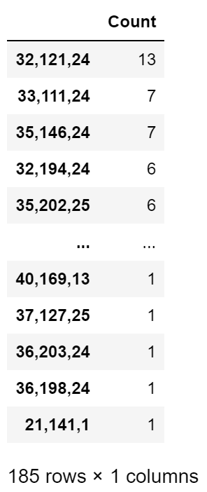
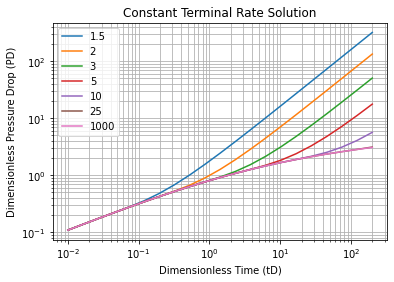
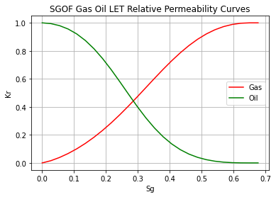
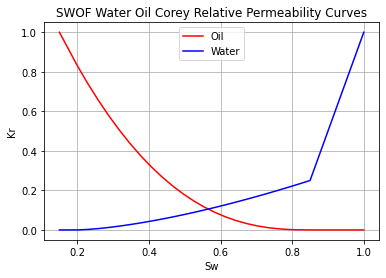

===================================
Simulation Helpers
===================================

Function List
=============

.. list-table:: Simulation Helpers
   :widths: 15 40
   :header-rows: 1

   * - Task
     - Function
   * - Extracting cells with convergence issues from IX PRT file
     - `pyrestoolbox.simtools.ix_extract_problem_cells`_
   * - Solves Van Everdingin & Hurst Constant Terminal Rate solution via inverse Laplace transform and optionally writes out ECLIPSE styled AQUTAB include file
     - `pyrestoolbox.simtools.influence_tables`_
   * - Performs a recursive deck zip/check for all INCLUDE files in ECL and IX files
     - `pyrestoolbox.simtools.zip_check_sim_deck`_
   * - Solves the Rachford Rice equation
     - `pyrestoolbox.simtools.rr_solver`_
   * - Generates ECLIPSE style relative permeability tables (Corey, LET, Jerauld)
     - `pyrestoolbox.simtools.rel_perm_table`_
   * - Corey relative permeability model
     - `pyrestoolbox.simtools.corey`_
   * - LET relative permeability model
     - `pyrestoolbox.simtools.LET`_
   * - Jerauld (Arco) two-parameter relative permeability model
     - `pyrestoolbox.simtools.jerauld`_
   * - Checks LET curve physicality (monotonicity and concavity)
     - `pyrestoolbox.simtools.is_let_physical`_
   * - Fits a relative permeability model to measured data
     - `pyrestoolbox.simtools.fit_rel_perm`_
   * - Fits all three kr models and returns the best fit
     - `pyrestoolbox.simtools.fit_rel_perm_best`_
   * - Generates Eclipse VFPINJ keyword tables for injection wells
     - `pyrestoolbox.simtools.make_vfpinj`_
   * - Generates Eclipse VFPPROD keyword tables for production wells
     - `pyrestoolbox.simtools.make_vfpprod`_
   * - Creates Oil-Gas-Water Black Oil tables with optional ECLIPSE export (PVDO, PVDG, PVTO)
     - `pyrestoolbox.simtools.make_bot_og`_
   * - Generates PVTW (water PVT) table with optional ECLIPSE export
     - `pyrestoolbox.simtools.make_pvtw_table`_

pyrestoolbox.simtools.ix_extract_problem_cells
======================

.. code-block:: python

    ix_extract_problem_cells(filename = '', silent = False) -> list

Processes Intersect PRT file to extract convergence issue information. Prints a summary of worst offenders to terminal (if silent == False), and returns a list of sorted dataframes summarising all entities in final convergence report rows in the PRT file.

List returned is [well_pressure_df, grid_pressure_df, sat_change_df, comp_change_df]

.. list-table:: Inputs
   :widths: 10 15 40
   :header-rows: 1

   * - Parameter
     - Type
     - Description
   * - filename
     - str
     - If empty, will search local directory for PRT file and present list to select from if more than one exists. If a filename is furnished, or only one file exists, then no selection will be presented
   * - silent
     - bool
     - False will return only the list of dataframes, with nothing echoed to the terminal. True will print summary of worst entities to the terminal as well as returning the list.

Examples:

.. code-block:: python

    >>> from pyrestoolbox import simtools
    >>> results = simtools.ix_extract_problem_cells()
    >>> wells, grid_pres, grid_sat, grid_comp = results
    >>> grid_sat
    Processing TEST.PRT

    Issue Type                 Total Instances  Most Frequent Actor      Instances
    -----------------------  -----------------  ---------------------  -----------
    Well Pressure Change                     0  None                             0
    Grid Pressure Change                    64  32,125,4                         2
    Grid Saturation Change                 310  32,121,24                       13
    Grid Composition Change               1627  35,212,25                      544

pyrestoolbox.simtools.influence_tables
======================

.. code-block:: python

    influence_tables(ReDs, min_td = 0.01, max_td = 200, n_incr = 20, M = 8, export = False)-> tuple

Solves Van Everdingin & Hurst Constant Terminal Rate solution via inverse Laplace transform and optionally writes out ECLIPSE styled AQUTAB include file.

Returns a tuple of;
    1. Dimensionless time list
    2. list of lists of dimensionless pressures at each dimensionless time for each dimensionless radius

.. list-table:: Inputs
   :widths: 10 15 40
   :header-rows: 1

   * - Parameter
     - Type
     - Description
   * - ReDs
     - list
     - A list of dimensionless radii > 1.0. These are the ratios of the exteral radius of the aquifer to the external radius of the reservoir (or internal radius of the aquifer)
   * - min_td
     - float
     - Minimum dimensionless time. Default = 0.01
   * - max_td
     - float
     - Maximum dimensionless time. Default = 200
   * - n_incr
     - int
     - Number of log transformed increments to split dimensionless time into. Default = 20
   * - M
     - int
     - Laplace invesrion accuracy. Higher = more accurate, but more time. Generally 6-12 is good range. Default = 8
   * - export
     - bool
     - Boolean value that controls whether an include file with 'INFLUENCE.INC' name is created. Default: False

Examples:

.. code-block:: python

    >>> from pyrestoolbox import simtools
    >>> import matplotlib.pyplot as plt
    >>> ReDs = [1.5, 2, 3, 5, 10, 25, 1000]
    >>> tds, pds = simtools.influence_tables(ReDs=ReDs, export=True)
    >>>
    >>> for p, pd in enumerate(pds):
    >>>     plt.plot(tds, pd, label = str(ReDs[p]))
    >>>
    >>> plt.xscale('log')
    >>> plt.yscale('log')
    >>> plt.legend(loc='upper left')
    >>> plt.grid(which='both')
    >>> plt.xlabel('Dimensionless Time (tD)')
    >>> plt.ylabel('Dimensionless Pressure Drop (PD)')
    >>> plt.title('Constant Terminal Rate Solution')
    >>> plt.show()

pyrestoolbox.simtools.zip_check_sim_deck
======================

.. code-block:: python

    zip_check_sim_deck(files2scrape = [], tozip = True, console_summary = True)

Performs a recursive zip/check on one or more ECL/IX decks.
Crawls through all INCLUDE files referenced in a deck, including an unlimited number of subdirectories and nested INCLUDE references,
and (a) checks that all include files exist, then optionally (b) creates a zip file of all required files.
It does NOT zip any files that are in a higher directory than the .DATA file, but it does flag any such files so users can manually include them

If files2scrape list is specified:
 - No user prompt for any options will be given

If files2scrape list is NOT specified:
 - User will be prompted to select one or more decks by their index number
 - Optionally creates a zip archive of available associated files

.. list-table:: Inputs
   :widths: 10 15 40
   :header-rows: 1

   * - Parameter
     - Type
     - Description
   * - files2scrape
     - list
     - A list of file names to scrape. These must be .DATA and/or .AFI files. If no (or empty) list is passed, then user will be prompted to select one or more from the files existing in the current directory
   * - to_zip
     - bool
     - True will create a zip archive of DATA file and all associated INCLUDE files from the same directory or below. False will only return summary of whether INCLUDE files are complete.
   * - console_summary
     - bool
     - True will return verbose summary to terminal. False will return only list of missing files with no terminal echo.

Examples:

.. code-block:: python

    >>> simtools.zip_check_sim_deck(['FIELD_A.DATA', 'FIELD_B.afi'], console_summary=False)
    ['INCLUDE/GridOpts.inc', 'INCLUDE/ZCORN_COORD.GRDECL', 'EPS.ixf']

    >>> simtools.zip_check_sim_deck()
      Index  File Name
    -------  ------------
          0  FIELD_A.DATA
          1  FIELD_B.afi

    Please choose index(s) of file to parse separated by commas (0 - 1) :0,1
    Zip or Check files? (Z/c): c
    Scanning through: FIELD_A.DATA
    Scanning through: FIELD_B.afi

    ****** MISSING FILES ******

    INCLUDE/GridOpts.inc from FIELD_A.DATA
    INCLUDE/ZCORN_COORD.GRDECL from FIELD_A.DATA
    EPS.ixf from FIELD_B.DATA

pyrestoolbox.simtools.rr_solver
======================

.. code-block:: python

    rr_solver(zi, ki)

Solves for the root of the Rachford-Rice equation using a method that gracefully handles catastrophic roundoff errors.
The method is outlined in 2022 'Fluid Phase Equilibria' paper by M. Nielsen & H. Lia

Returns a tuple of results

.. list-table:: Inputs
   :widths: 10 15 40
   :header-rows: 1

   * - Parameter
     - Type
     - Description
   * - zi
     - np.array
     - Molar composition (Percent, Fraction or Amounts - will be normalized)
   * - ki
     - np.array
     - K-values of the respective molar species

.. list-table:: Output Tuple
   :widths: 10 15 40
   :header-rows: 1

   * - Parameter
     - Type
     - Description
   * - N_it
     - Integer
     - Number of iterations required to solve
   * - yi
     - np.array
     - Vapor mole fraction compositions
   * - xi
     - np.array
     - Liquid mole fraction compositions
   * - V
     - Float
     - Vapor molar fraction
   * - L
     - Float
     - Liquid molar fraction

Examples:

.. code-block:: python

    >>> simtools.rr_solver(zi =np.array([0.7, 0.15, 0.1, 0.05]), ki = np.array([50, 5, 0.5, 0.01]))
    (6,
    array([0.7406252 , 0.1570315 , 0.09469948, 0.00764382]),
    array([0.0148125 , 0.0314063 , 0.18939896, 0.76438224]),
    0.9440279802330239,
    0.05597201976697608)

pyrestoolbox.simtools.rel_perm_table
======================

.. code-block:: python

    rel_perm_table(rows, krtable='SWOF', krfamily='COR', kromax=1, krgmax=1, krwmax=1, swc=0, swcr=0, sorg=0, sorw=0, sgcr=0, no=1, nw=1, ng=1, Lw=1, Ew=1, Tw=1, Lo=1, Eo=1, To=1, Lg=1, Eg=1, Tg=1, aw=1, bw=1, ao=1, bo=1, ag=1, bg=1, export=False)-> pd.DataFrame:

.. list-table:: Inputs
   :widths: 10 15 40
   :header-rows: 1

   * - Parameter
     - Type
     - Description
   * - rows
     - int
     - Integer value specifying the number of table rows desired
   * - krtable
     - str or kr_table class object
     - A string or kr_table Enum class that specifies one of three table type choices - SWOF, SGOF or SGWFN. Default is 'SWOF'.
   * - krfamily
     - str or kr_family class object
     - A string or kr_family Enum class that specifies one of three curve function choices - COR, LET, or JER. Default is 'COR'
   * - kromax
     - float
     - Max Kr relative to oil. Default value = 1
   * - krgmax
     - float
     - Max Kr relative to gas. Default value = 1
   * - krwmax
     - float
     - Max Kr relative to water with a second phase present. Default value = 1
   * - swc
     - float
     - Minimum water saturation. Default value = 0
   * - swcr
     - float
     - Maximum water saturation for imobile water. Default value = 0
   * - sorg
     - float
     - Maximum oil saturation relative to gas for imobile oil. Default value = 0
   * - sorw
     - float
     - Maximum oil saturation relative to water for imobile oil. Default value = 0
   * - sgcr
     - float
     - Maximum gas saturation relative to water for imobile gas. Default value = 0
   * - no, nw, ng
     - float
     - Corey exponents to oil, water and gas respectively. Default values = 1
   * - Lw, Ew, Tw
     - float
     - LET exponents to water. Default values = 1
   * - Lo, Eo, To
     - float
     - LET exponents to oil. Default values = 1
   * - Lg, Eg, Tg
     - float
     - LET exponents to gas. Default values = 1
   * - aw, bw
     - float
     - Jerauld parameters for water phase. Default values = 1
   * - ao, bo
     - float
     - Jerauld parameters for oil phase. Default values = 1
   * - ag, bg
     - float
     - Jerauld parameters for gas phase. Default values = 1
   * - export
     - bool
     - Boolean flag that controls whether an include file with same name as krtable is created. Default: False

.. list-table:: Method Variables & Class Objects
   :widths: 10 15 40
   :header-rows: 1

   * - Class Variable
     - Class Object
     - Class Description & Options
   * - krfamily
     - kr_family
     - A string or kr_family Enum class that specifies one of three curve function choices. Defaults to 'COR'.
       Options are:
        + 'COR': Corey Curve function
        + 'LET': LET Relative permeability function
        + 'JER': Jerauld (Arco) two-parameter model
   * - krtable
     - kr_table
     - A string or kr_table Enum class that specifies one of three table type choices. Default is 'SWOF'.
       Options are:
        + SWOF: Water / Oil table
        + SGOF: Gas / Oil table
        + SGFN: Gas / Water table

Examples:

.. code-block:: python

    >>> from pyrestoolbox import simtools
    >>> import matplotlib.pyplot as plt
    >>> df = simtools.rel_perm_table(rows=25, krtable='SGOF', krfamily='LET', kromax =1, krgmax =1, swc =0.2, sorg =0.15, Lo=2.5, Eo = 1.25, To = 1.75, Lg = 1.2, Eg = 1.5, Tg = 2.0)
    >>> plt.plot(df['Sg'], df['Krgo'], c = 'r', label='Gas')
    >>> plt.plot(df['Sg'], df['Krog'], c = 'g', label='Oil')
    >>> plt.title('SGOF Gas Oil LET Relative Permeability Curves')
    >>> plt.xlabel('Sg')
    >>> plt.ylabel('Kr')
    >>> plt.legend()
    >>> plt.grid('both')
    >>> plt.plot()

.. code-block:: python

    >>> df = simtools.rel_perm_table(rows=25, krtable='SWOF', kromax =1, krwmax =0.25, swc =0.15, swcr = 0.2, sorw =0.15, no=2.5, nw=1.5)
    >>> plt.plot(df['Sw'], df['Krow'], c = 'g', label='Oil')
    >>> plt.plot(df['Sw'], df['Krwo'], c = 'b', label='Water')
    >>> plt.title('SWOF Water Oil Corey Relative Permeability Curves')
    >>> plt.xlabel('Sw')
    >>> plt.ylabel('Kr')
    >>> plt.legend()
    >>> plt.grid('both')
    >>> plt.plot()

pyrestoolbox.simtools.corey
======================

.. code-block:: python

    corey(s, n) -> np.ndarray

Returns Corey relative permeability values: ``kr = S^n``.

.. list-table:: Inputs
   :widths: 10 15 40
   :header-rows: 1

   * - Parameter
     - Type
     - Description
   * - s
     - np.ndarray
     - Normalized saturation of the phase (0-1)
   * - n
     - float
     - Corey exponent

Examples:

.. code-block:: python

    >>> from pyrestoolbox import simtools
    >>> import numpy as np
    >>> s = np.linspace(0, 1, 5)
    >>> simtools.corey(s, n=2.0)
    array([0.    , 0.0625, 0.25  , 0.5625, 1.    ])

pyrestoolbox.simtools.LET
======================

.. code-block:: python

    LET(s, L, E, T) -> np.ndarray

Returns LET relative permeability values (Lomeland, Ebeltoft & Thomas, 2005): ``kr = S^L / (S^L + E * (1 - S)^T)``.

.. list-table:: Inputs
   :widths: 10 15 40
   :header-rows: 1

   * - Parameter
     - Type
     - Description
   * - s
     - np.ndarray
     - Normalized saturation of the phase (0-1)
   * - L
     - float
     - LET 'L' parameter
   * - E
     - float
     - LET 'E' parameter
   * - T
     - float
     - LET 'T' parameter

Examples:

.. code-block:: python

    >>> from pyrestoolbox import simtools
    >>> import numpy as np
    >>> s = np.linspace(0, 1, 5)
    >>> simtools.LET(s, L=2.0, E=1.5, T=2.0)
    array([0.        , 0.02298851, 0.14285714, 0.50420168, 1.        ])

pyrestoolbox.simtools.jerauld
======================

.. code-block:: python

    jerauld(s, a, b) -> np.ndarray

Returns Jerauld (Arco) relative permeability values for the two-parameter model: ``kr = ((1+b) * S^a) / (1 + b * S^c)`` where ``c = a * (1 + 1/b)``.

.. list-table:: Inputs
   :widths: 10 15 40
   :header-rows: 1

   * - Parameter
     - Type
     - Description
   * - s
     - np.ndarray
     - Normalized saturation of the phase (0-1)
   * - a
     - float
     - Jerauld 'a' parameter (> 0)
   * - b
     - float
     - Jerauld 'b' parameter (> 0)

Examples:

.. code-block:: python

    >>> from pyrestoolbox import simtools
    >>> import numpy as np
    >>> s = np.linspace(0, 1, 5)
    >>> simtools.jerauld(s, a=2.0, b=1.0)
    array([0.  , 0.1 , 0.36, 0.72, 1.  ])

pyrestoolbox.simtools.is_let_physical
======================

.. code-block:: python

    is_let_physical(s, L, E, T) -> bool

Checks if a LET relative permeability curve is physical - that it is monotonically increasing with no spurious inflection-point reversals in concavity.

.. list-table:: Inputs
   :widths: 10 15 40
   :header-rows: 1

   * - Parameter
     - Type
     - Description
   * - s
     - np.ndarray
     - Normalized saturation array (should be sorted, e.g. np.linspace(0, 1, 100))
   * - L
     - float
     - LET 'L' parameter
   * - E
     - float
     - LET 'E' parameter
   * - T
     - float
     - LET 'T' parameter

Examples:

.. code-block:: python

    >>> from pyrestoolbox import simtools
    >>> import numpy as np
    >>> s = np.linspace(0, 1, 100)
    >>> simtools.is_let_physical(s, L=2.0, E=1.5, T=2.0)
    True

pyrestoolbox.simtools.fit_rel_perm
======================

.. code-block:: python

    fit_rel_perm(sw, kr, krfamily='COR', krmax=1.0, sw_min=0.0, sw_max=1.0) -> dict

Fits a relative permeability model (Corey, LET, or Jerauld) to measured kr data using least-squares optimization.

.. list-table:: Inputs
   :widths: 10 15 40
   :header-rows: 1

   * - Parameter
     - Type
     - Description
   * - sw
     - array-like
     - Array of water (or gas) saturation values corresponding to kr data
   * - kr
     - array-like
     - Array of measured relative permeability values
   * - krfamily
     - str or kr_family
     - Model to fit: 'COR' (Corey, 1 param), 'LET' (3 params), or 'JER' (Jerauld, 2 params). Default 'COR'
   * - krmax
     - float
     - Maximum kr endpoint value. Model is scaled by this value. Default 1.0
   * - sw_min
     - float
     - Minimum saturation endpoint (critical saturation). Default 0.0
   * - sw_max
     - float
     - Maximum saturation endpoint. Default 1.0

Returns a dictionary with keys: ``params`` (dict of fitted parameter names and values), ``krmax``, ``sw_min``, ``sw_max``, ``residuals`` (array), ``ssq`` (sum of squared residuals), ``kr_pred`` (predicted kr at input points).

Examples:

.. code-block:: python

    >>> from pyrestoolbox import simtools
    >>> import numpy as np
    >>> sw = np.array([0.2, 0.3, 0.4, 0.5, 0.6, 0.7, 0.8])
    >>> kr = np.array([0.0, 0.02, 0.08, 0.18, 0.33, 0.55, 0.85])
    >>> result = simtools.fit_rel_perm(sw, kr, krfamily='COR', krmax=0.85, sw_min=0.2, sw_max=0.8)
    >>> result['params']
    {'n': ...}
    >>> result['ssq']
    ...

pyrestoolbox.simtools.fit_rel_perm_best
======================

.. code-block:: python

    fit_rel_perm_best(sw, kr, krmax=1.0, sw_min=0.0, sw_max=1.0) -> dict

Fits all three relative permeability models (Corey, LET, Jerauld) to measured data and returns the best fit (lowest sum of squared residuals).

.. list-table:: Inputs
   :widths: 10 15 40
   :header-rows: 1

   * - Parameter
     - Type
     - Description
   * - sw
     - array-like
     - Array of saturation values corresponding to kr data
   * - kr
     - array-like
     - Array of measured relative permeability values
   * - krmax
     - float
     - Maximum kr endpoint value. Default 1.0
   * - sw_min
     - float
     - Minimum saturation endpoint. Default 0.0
   * - sw_max
     - float
     - Maximum saturation endpoint. Default 1.0

Returns a dictionary with same keys as ``fit_rel_perm``, plus ``family`` (name of best-fit model) and ``all_results`` (dict of all three fit results keyed by family name).

Examples:

.. code-block:: python

    >>> from pyrestoolbox import simtools
    >>> import numpy as np
    >>> sw = np.array([0.2, 0.3, 0.4, 0.5, 0.6, 0.7, 0.8])
    >>> kr = np.array([0.0, 0.02, 0.08, 0.18, 0.33, 0.55, 0.85])
    >>> result = simtools.fit_rel_perm_best(sw, kr, krmax=0.85, sw_min=0.2, sw_max=0.8)
    >>> result['family']
    'LET'

.. note::

    **Metric unit support**: The ``make_vfpinj``, ``make_vfpprod``, ``make_bot_og``, and ``make_pvtw_table`` functions accept a ``metric=False`` parameter. When ``metric=True``, all inputs and outputs use Eclipse METRIC units (barsa, deg C, sm3/d, sm3/sm3, m, kg/m3, 1/bar) and the generated Eclipse keyword strings use the METRIC unit system. All "standard" volumes reference oilfield standard conditions (60 deg F, 14.696 psia) regardless of unit system selection.

pyrestoolbox.simtools.make_vfpinj
======================

.. code-block:: python

    make_vfpinj(table_num, completion, flo_type='WAT', vlpmethod='WG', flo_rates=None, thp_values=None, gas_pvt=None, gsg=0.65, wsg=1.07, oil_pvt=None, pb=0, rsb=0, sgsp=0.65, api=35, datum_depth=0, export=False, filename='', metric=False) -> dict

Generates an Eclipse VFPINJ keyword table for injection wells. Computes BHP as a function of flow rate and tubing head pressure using the nodal module VLP correlations.

.. list-table:: Inputs
   :widths: 10 15 40
   :header-rows: 1

   * - Parameter
     - Type
     - Description
   * - table_num
     - int
     - VFP table number (>= 1)
   * - completion
     - Completion
     - A nodal.Completion object describing the wellbore geometry
   * - flo_type
     - str
     - Flow rate type: 'WAT' (water), 'GAS' (gas), or 'OIL' (oil). Default 'WAT'
   * - vlpmethod
     - str
     - VLP correlation: 'HB', 'WG', 'GRAY', or 'BB'. Default 'WG'
   * - flo_rates
     - list
     - Flow rates in ascending order. Units: stb/d (WAT/OIL) or Mscf/d (GAS) in field; sm3/d in metric. Default provided if None
   * - thp_values
     - list
     - Tubing head pressures (psia, or barsa if metric=True) in ascending order. Default provided if None
   * - gas_pvt
     - GasPVT
     - Optional GasPVT object for gas injection
   * - gsg
     - float
     - Gas specific gravity. Default 0.65
   * - wsg
     - float
     - Water specific gravity. Default 1.07
   * - oil_pvt
     - OilPVT
     - Optional OilPVT object for oil injection
   * - pb
     - float
     - Bubble point pressure (psia). Default 0
   * - rsb
     - float
     - Solution GOR at Pb (scf/stb). Default 0
   * - sgsp
     - float
     - Separator gas SG. Default 0.65
   * - api
     - float
     - API gravity. Default 35
   * - datum_depth
     - float
     - Bottom hole datum depth (ft, or m if metric=True). Default = completion total TVD
   * - export
     - bool
     - If True, writes an Eclipse VFP file. Default False
   * - filename
     - str
     - Custom output filename. Default: VFPINJ_{table_num}.VFP
   * - metric
     - bool
     - If True, inputs/outputs use Eclipse METRIC units (barsa, sm3/d, m). Eclipse keyword output uses 'METRIC' unit system. Default False

Returns a dictionary with keys: ``table_num``, ``datum_depth``, ``flo_type``, ``flo_rates``, ``thp_values``, ``bhp`` (2D numpy array shape NTHP x NFLO), ``n_failed``, ``eclipse_string``.

Examples:

.. code-block:: python

    >>> from pyrestoolbox import simtools, nodal
    >>> comp = nodal.Completion(tid=2.441, length=8000, tht=100, bht=200)
    >>> result = simtools.make_vfpinj(table_num=1, completion=comp, flo_type='WAT',
    ...                               thp_values=[100, 500, 1000])
    >>> result['bhp'].shape  # (NTHP, NFLO)
    (3, 6)

pyrestoolbox.simtools.make_vfpprod
======================

.. code-block:: python

    make_vfpprod(table_num, completion, well_type='gas', vlpmethod='WG', flo_rates=None, thp_values=None, wfr_values=None, gfr_values=None, alq_values=None, gas_pvt=None, gsg=0.65, oil_vis=1.0, api=45, pr=0, oil_pvt=None, pb=0, rsb=0, sgsp=0.65, wsg=1.07, datum_depth=0, export=False, filename='', metric=False) -> dict

Generates an Eclipse VFPPROD keyword table for production wells. Computes BHP as a function of flow rate, tubing head pressure, water fraction, gas fraction, and artificial lift quantity using the nodal module VLP correlations.

For gas wells: FLO=GAS (Mscf/d, or sm3/d if metric), WFR=WGR (stb/Mscf, or sm3/sm3 if metric), GFR=OGR (stb/Mscf, or sm3/sm3 if metric)

For oil wells: FLO=OIL (stb/d, or sm3/d if metric), WFR=WCT (fraction 0-1), GFR=GOR (Mscf/stb, or sm3/sm3 if metric)

.. list-table:: Inputs
   :widths: 10 15 40
   :header-rows: 1

   * - Parameter
     - Type
     - Description
   * - table_num
     - int
     - VFP table number (>= 1)
   * - completion
     - Completion
     - A nodal.Completion object describing the wellbore geometry
   * - well_type
     - str
     - 'gas' or 'oil'. Default 'gas'
   * - vlpmethod
     - str
     - VLP correlation: 'HB', 'WG', 'GRAY', or 'BB'. Default 'WG'
   * - flo_rates
     - list
     - Flow rates in ascending order. Gas wells: Mscf/d or sm3/d (metric). Oil wells: stb/d or sm3/d (metric). Default provided if None
   * - thp_values
     - list
     - Tubing head pressures (psia, or barsa if metric=True). Default provided if None
   * - wfr_values
     - list
     - Water fraction values. Gas wells: WGR (stb/Mscf, or sm3/sm3 if metric). Oil wells: WCT (fraction). Default provided if None
   * - gfr_values
     - list
     - Gas/oil fraction values. Gas wells: OGR (stb/Mscf, or sm3/sm3 if metric). Oil wells: GOR (Mscf/stb, or sm3/sm3 if metric). Default provided if None
   * - alq_values
     - list
     - Artificial lift values. Default [0]
   * - gas_pvt
     - GasPVT
     - Optional GasPVT object for gas wells
   * - gsg
     - float
     - Gas specific gravity. Default 0.65
   * - oil_vis
     - float
     - Condensate viscosity (cP) for gas wells. Default 1.0
   * - api
     - float
     - API gravity. Default 45
   * - pr
     - float
     - Reservoir pressure for condensate dropout model (0 disables). Default 0
   * - oil_pvt
     - OilPVT
     - Optional OilPVT object for oil wells
   * - pb
     - float
     - Bubble point pressure (psia, or barsa if metric=True). Required for oil wells
   * - rsb
     - float
     - Solution GOR at Pb (scf/stb, or sm3/sm3 if metric=True). Required for oil wells
   * - sgsp
     - float
     - Separator gas SG. Default 0.65
   * - wsg
     - float
     - Water specific gravity. Default 1.07
   * - datum_depth
     - float
     - Bottom hole datum depth (ft, or m if metric=True). Default = completion total TVD
   * - export
     - bool
     - If True, writes an Eclipse VFP file. Default False
   * - filename
     - str
     - Custom output filename. Default: VFPPROD_{table_num}.VFP
   * - metric
     - bool
     - If True, inputs/outputs use Eclipse METRIC units (barsa, sm3/d, sm3/sm3, m). Eclipse keyword output uses 'METRIC' unit system. Default False

Returns a dictionary with keys: ``table_num``, ``datum_depth``, ``well_type``, ``flo_type``, ``wfr_type``, ``gfr_type``, ``flo_rates``, ``thp_values``, ``wfr_values``, ``gfr_values``, ``alq_values``, ``bhp`` (5D numpy array shape NTHP x NWFR x NGFR x NALQ x NFLO), ``n_failed``, ``eclipse_string``.

Examples:

.. code-block:: python

    >>> from pyrestoolbox import simtools, nodal
    >>> comp = nodal.Completion(tid=2.441, length=8000, tht=100, bht=200)
    >>> result = simtools.make_vfpprod(table_num=1, completion=comp, well_type='gas',
    ...                                flo_rates=[1000, 5000, 10000],
    ...                                thp_values=[100, 500],
    ...                                wfr_values=[0, 0.005],
    ...                                gfr_values=[0, 0.05],
    ...                                alq_values=[0])
    >>> result['bhp'].shape  # (NTHP, NWFR, NGFR, NALQ, NFLO)
    (2, 2, 2, 1, 3)

pyrestoolbox.simtools.make_bot_og
======================

.. code-block:: python

    make_bot_og(pi, api, degf, sg_g, pmax, pb=0, rsb=0, pmin=25, nrows=20, wt=0, ch4_sat=0, comethod='EXPLT', zmethod='DAK', rsmethod='VELAR', cmethod='PMC', denomethod='SWMH', bomethod='MCAIN', pbmethod='VELAR', export=False, pvto=False, metric=False) -> dict

Creates data required for Oil-Gas-Water black oil tables (PVDO, PVDG, optionally PVTO).

.. note::

    This function was moved from the oil module to simtools in v3.0. A backward-compatible wrapper remains at ``oil.make_bot_og()`` that delegates to this function.

Returns dictionary of results with keys:
  - ``bot``: Pandas DataFrame of black oil data
  - ``deno``: Stock tank oil density (lb/cuft, or kg/m3 if metric)
  - ``deng``: Stock tank gas density (lb/cuft, or kg/m3 if metric)
  - ``denw``: Water density at Pi (lb/cuft, or kg/m3 if metric)
  - ``cw``: Water compressibility at Pi (1/psi, or 1/bar if metric)
  - ``uw``: Water viscosity at Pi (cP)
  - ``pb``: Bubble point pressure (psia, or barsa if metric)
  - ``rsb``: Solution GOR at Pb (scf/stb, or sm3/sm3 if metric)
  - ``rsb_scale``: Scaling factor for Pb/Rsb harmonization
  - ``usat``: Undersaturated values [usat_p, usat_bo, usat_uo] (if pvto=True)

.. list-table:: Inputs
   :widths: 10 15 40
   :header-rows: 1

   * - Parameter
     - Type
     - Description
   * - pi
     - float
     - Initial reservoir pressure (psia, or barsa if metric=True)
   * - api
     - float
     - Stock tank oil density (deg API)
   * - degf
     - float
     - Reservoir temperature (deg F, or deg C if metric=True)
   * - sg_g
     - float
     - Weighted average specific gravity of surface gas (relative to air)
   * - pmax
     - float
     - Maximum pressure for table (psia, or barsa if metric=True)
   * - pb
     - float
     - Bubble point pressure (psia, or barsa if metric=True). Default 0 (will be calculated from rsb)
   * - rsb
     - float
     - Oil solution GOR at Pb (scf/stb, or sm3/sm3 if metric=True). Default 0 (will be calculated from pb)
   * - pmin
     - float
     - Minimum pressure for table (psia, or barsa if metric=True). Default 25
   * - nrows
     - int
     - Number of table rows. Default 20
   * - wt
     - float
     - Salt wt% (0-100) in brine. Default 0
   * - ch4_sat
     - float
     - Degree of methane saturation (0-1) in brine. Default 0
   * - export
     - bool
     - If True, exports PVDG.INC, PVDO.INC (and PVTO.INC if pvto=True) plus bot.xlsx. Default False
   * - pvto
     - bool
     - If True, generates live oil PVTO format with undersaturated extensions. Default False
   * - metric
     - bool
     - If True, inputs/outputs use Eclipse METRIC units (barsa, deg C, sm3/sm3, kg/m3, 1/bar). Eclipse keyword output uses METRIC format. Default False

Examples:

.. code-block:: python

    >>> from pyrestoolbox import simtools
    >>> results = simtools.make_bot_og(pi=4000, api=38, degf=175, sg_g=0.68, pmax=5000, pb=3900, rsb=2300, nrows=50)
    >>> df = results['bot']
    >>> print('Stock Tank Oil Density:', results['deno'], 'lb/cuft')

pyrestoolbox.simtools.make_pvtw_table
======================

.. code-block:: python

    make_pvtw_table(pi, degf, wt=0, ch4_sat=0, pmin=500, pmax=10000, nrows=20, export=False, metric=False) -> dict

Generates a PVTW (water PVT) table over a pressure range using brine_props (Spivey correlation), with optional ECLIPSE PVTW keyword export.

.. note::

    This function was moved from the brine module to simtools in v3.0. A backward-compatible wrapper remains at ``brine.make_pvtw_table()`` that delegates to this function.

Returns dictionary with keys: ``table`` (DataFrame), ``pref`` (psia, or barsa if metric), ``bw_ref``, ``cw_ref`` (1/psi, or 1/bar if metric), ``visw_ref`` (cP), ``rsw_ref`` (scf/stb, or sm3/sm3 if metric), ``den_ref`` (sg).

.. list-table:: Inputs
   :widths: 10 15 40
   :header-rows: 1

   * - Parameter
     - Type
     - Description
   * - pi
     - float
     - Initial (reference) pressure (psia, or barsa if metric=True)
   * - degf
     - float
     - Temperature (deg F, or deg C if metric=True)
   * - wt
     - float
     - Salt wt% (0-100). Default 0
   * - ch4_sat
     - float
     - Degree of methane saturation (0-1). Default 0
   * - pmin
     - float
     - Minimum pressure for table (psia, or barsa if metric=True). Default 500
   * - pmax
     - float
     - Maximum pressure for table (psia, or barsa if metric=True). Default 10000
   * - nrows
     - int
     - Number of rows in table. Default 20
   * - export
     - bool
     - If True, writes PVTW.INC and pvtw_table.xlsx. Default False
   * - metric
     - bool
     - If True, inputs/outputs use Eclipse METRIC units (barsa, deg C, sm3/sm3, 1/bar). Eclipse keyword output uses METRIC format. Default False

Examples:

.. code-block:: python

    >>> from pyrestoolbox import simtools
    >>> result = simtools.make_pvtw_table(pi=4000, degf=200, wt=3, nrows=10)
    >>> result['bw_ref']
    1.033...
    >>> result['table']
       Pressure (psia)  Bw (rb/stb)  ...
